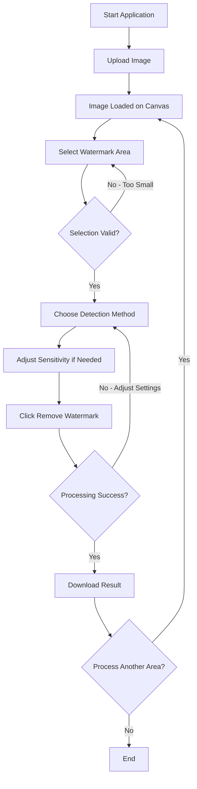
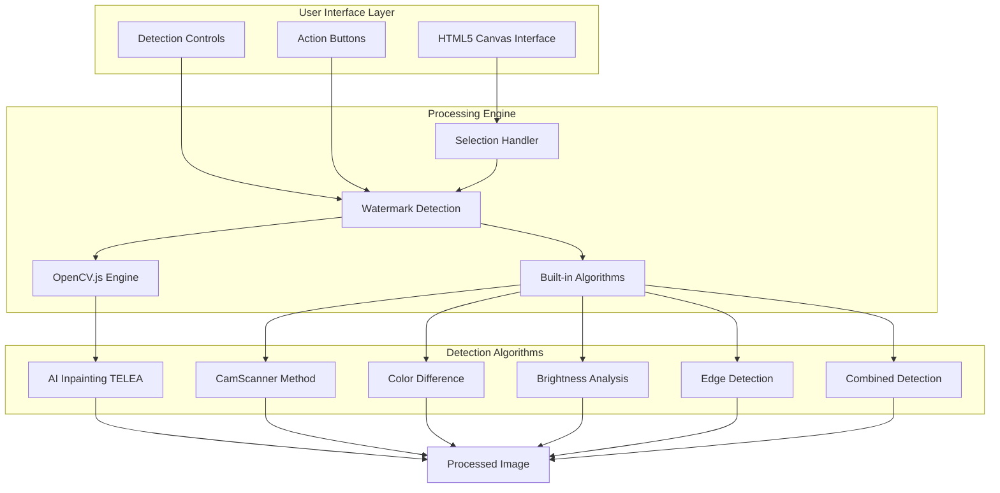
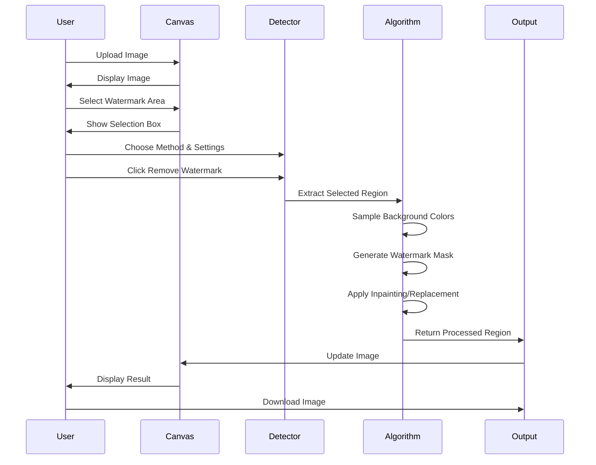

# 🎨 xsukax Image Watermark Remover

A professional, browser-based watermark removal tool powered by OpenCV.js that provides advanced AI-driven inpainting capabilities with complete client-side processing for maximum privacy and security.

## 📋 Project Overview

xsukax Image Watermark Remover is a sophisticated web application designed to intelligently detect and remove watermarks from images using state-of-the-art computer vision algorithms. Built entirely on client-side technologies, this tool eliminates the need for server-side processing, ensuring that your images never leave your device. The application leverages OpenCV.js—the JavaScript port of the renowned OpenCV library—to deliver professional-grade watermark removal through multiple detection algorithms and AI-powered inpainting techniques.

The tool offers an intuitive interface where users can upload images, manually select watermarked regions, choose from various detection methods, and seamlessly remove unwanted watermarks while preserving image quality. Whether you're a photographer, content creator, or professional needing to clean up images, this application provides enterprise-level functionality through a simple browser interface.

## 🔒 Security and Privacy Benefits

This application prioritizes user privacy and data security through comprehensive client-side architecture and transparent processing:

### Complete Client-Side Processing
All image processing operations execute entirely within your web browser using JavaScript and WebAssembly technologies. Your images never leave your device, are never uploaded to external servers, and are never transmitted over the network. This architecture eliminates potential data interception risks and ensures absolute control over your sensitive content.

### Zero Data Collection
The application does not collect, store, or transmit any user data, images, or metadata. No analytics tracking, no cookies for monitoring, and no server-side logging occur during usage. Your privacy remains completely intact throughout the entire workflow.

### Offline Capability
Once the initial page loads and OpenCV.js downloads, the application can function completely offline. This enables secure watermark removal in air-gapped environments or situations where internet connectivity poses security concerns.

### Open Source Transparency
As an open-source project, the entire codebase is publicly available for security auditing and verification. Users and security professionals can inspect every line of code to confirm the absence of backdoors, data exfiltration mechanisms, or privacy-compromising features.

### No Authentication Required
The tool requires no user accounts, registration, or personal information, further minimizing your digital footprint and eliminating risks associated with credential management or data breaches.

### Browser Sandboxing
Operating within the browser's security sandbox provides an additional layer of protection, isolating the application from your operating system and preventing unauthorized access to system resources.

## ✨ Features and Advantages

### Advanced Detection Algorithms
- **OpenCV AI Inpainting**: Utilizes the TELEA (Fast Marching Method) algorithm for professional-quality inpainting that intelligently reconstructs watermarked regions
- **CamScanner Optimized**: Specialized algorithm designed for document watermarks and scanned images
- **Combined Detection**: Merges multiple detection methods for enhanced accuracy on complex watermarks
- **Color Difference Detection**: Identifies watermarks based on color variance from surrounding background
- **Brightness Analysis**: Detects watermarks through luminosity differences
- **Edge Detection**: Locates watermarks using boundary and gradient analysis

### User-Friendly Interface
- **Interactive Selection**: Precise click-and-drag interface for defining watermark regions
- **Real-Time Preview**: Immediate visual feedback during selection and processing
- **GitHub-Inspired Design**: Clean, professional aesthetic with intuitive controls
- **Responsive Layout**: Adapts seamlessly to various screen sizes and devices

### Flexible Processing Controls
- **Adjustable Sensitivity**: Fine-tune detection thresholds (20-100) to match different watermark types
- **Configurable Inpaint Radius**: Control the spread of inpainting (3-20 pixels) for optimal results
- **Multiple Method Support**: Switch between detection algorithms to find the best approach for each image

### Technical Capabilities
- **High-Resolution Support**: Processes images up to 10MB in size
- **Multiple Format Compatibility**: Supports PNG, JPG, and JPEG file formats
- **Instant Downloads**: Export processed images immediately in PNG format
- **Reset Functionality**: Quickly restore original images for re-processing

### Performance Benefits
- **No Queue Times**: Instant processing without server wait times
- **Unlimited Usage**: No processing limits, quotas, or usage restrictions
- **Cross-Platform**: Works on Windows, macOS, Linux, and mobile devices with modern browsers

## 🚀 Installation Instructions

xsukax Image Watermark Remover requires no traditional installation. As a web-based application, it runs directly in your browser:

### Option 1: Online Access (Recommended for General Use)
1. Navigate to the GitHub Pages hosted version at: `https://xsukax.github.io/xsukax-Image-Watermark-Remover/`
2. Wait for OpenCV.js to load (indicated by the "OPENCV READY ✓" badge)
3. Begin using the application immediately

### Option 2: Local Deployment (Recommended for Offline/Secure Environments)
1. Clone the repository:
   ```bash
   git clone https://github.com/xsukax/xsukax-Image-Watermark-Remover.git
   ```

2. Navigate to the project directory:
   ```bash
   cd xsukax-Image-Watermark-Remover
   ```

3. Serve the application using a local web server:
   
   **Using Python 3:**
   ```bash
   python -m http.server 8000
   ```
   
   **Using Node.js (http-server):**
   ```bash
   npx http-server -p 8000
   ```
   
   **Using PHP:**
   ```bash
   php -S localhost:8000
   ```

4. Open your browser and navigate to `http://localhost:8000`

### System Requirements
- **Browser**: Modern web browser with WebAssembly support (Chrome 57+, Firefox 52+, Safari 11+, Edge 79+)
- **Memory**: Minimum 2GB RAM recommended for processing large images
- **Storage**: Negligible disk space (single HTML file)
- **Internet**: Required for initial load to download OpenCV.js (~8MB); optional thereafter

### Fallback Mode
If OpenCV.js fails to load (due to network restrictions or compatibility issues), the application automatically switches to "BUILT-IN MODE" using native JavaScript algorithms. While less sophisticated than OpenCV AI methods, built-in algorithms still provide functional watermark removal capabilities.

## 📖 Usage Guide

### Basic Workflow



### Step-by-Step Instructions

#### 1. Upload Your Image
- **Method A**: Click the upload area labeled "Click to upload or drag and drop"
- **Method B**: Drag and drop an image file directly onto the upload area
- **Supported Formats**: PNG, JPG, JPEG (maximum 10MB)
- **Result**: Your image appears on the canvas once loaded successfully

#### 2. Select the Watermark Region
- Click and hold at one corner of the watermark area
- Drag to the opposite corner to create a selection box (blue highlighted region)
- Release the mouse button to complete the selection
- **Tip**: Ensure your selection fully encompasses the watermark with a small margin around it
- **Minimum Size**: Selections must be at least 10×10 pixels

#### 3. Configure Detection Settings

**Detection Method Selection:**
- **OpenCV AI Inpainting (Best)**: Recommended for most scenarios; uses advanced algorithms for seamless reconstruction
- **CamScanner Optimized**: Ideal for document watermarks, timestamps, or scanned materials
- **Combined Detection**: Employs multiple techniques simultaneously for stubborn watermarks
- **Color Difference**: Effective for watermarks with distinct colors
- **Brightness Difference**: Best for watermarks that differ in luminosity
- **Edge Detection**: Suitable for watermarks with clear boundaries

**Sensitivity Adjustment:**
- **Range**: 20-100
- **Lower Values (20-40)**: Detect only highly distinct watermarks; use when watermark has strong contrast
- **Medium Values (40-60)**: Default balanced setting for typical watermarks
- **Higher Values (60-100)**: Detect subtle or semi-transparent watermarks; may capture unwanted areas

**Inpaint Radius (OpenCV AI only):**
- **Range**: 3-20 pixels
- **Lower Values (3-5)**: Tighter, more precise inpainting for small or thin watermarks
- **Higher Values (10-20)**: Broader reconstruction for large or complex watermarks

#### 4. Remove the Watermark
- Click the "✨ Remove Watermark" button
- **Processing Time**: Typically 1-5 seconds depending on selection size and method
- **Status Updates**: Monitor progress messages at the bottom of the controls
- **Success Indicator**: Message displays pixel count removed (e.g., "✨ Removed 1,243 pixels with AI!")

#### 5. Evaluate and Refine
- Examine the processed region carefully
- If results are unsatisfactory:
  - Click "🔄 Reset" to restore the original image
  - Try a different detection method
  - Adjust sensitivity settings
  - Refine your selection area
- If results are satisfactory, proceed to download or process additional areas

#### 6. Download Your Image
- Click the "💾 Download" button
- File saves automatically as `watermark-removed-[timestamp].png`
- **Format**: PNG (lossless compression, preserves quality)

### Application Architecture



### Processing Flow Detail



### Tips for Optimal Results

**For Text Watermarks:**
- Use "OpenCV AI Inpainting" or "CamScanner Optimized" methods
- Set sensitivity between 50-70
- Ensure selection box includes a 5-10 pixel margin around text

**For Logo Watermarks:**
- Try "OpenCV AI Inpainting" first with inpaint radius 5-8
- If logo has complex colors, test "Combined Detection"
- Increase sensitivity if logo is semi-transparent

**For Timestamp Watermarks:**
- "CamScanner Optimized" works best
- Sensitivity 60-80 for typical camera timestamps
- Small selection areas process faster

**For Large or Complex Watermarks:**
- Use "OpenCV AI Inpainting" with higher inpaint radius (12-20)
- Process in multiple passes if necessary
- Consider using "Combined Detection" for challenging cases

**For Subtle/Faded Watermarks:**
- Increase sensitivity to 70-100
- Use "Brightness Difference" or "Combined Detection"
- May require multiple processing iterations

## 📄 License

This project is licensed under the GNU General Public License v3.0, which permits free use, modification, and distribution while ensuring derivative works remain open source.

---

## 🤝 Contributing

Contributions are welcome! Please feel free to submit pull requests, report issues, or suggest enhancements through the GitHub repository.

## 📞 Support

For questions, bug reports, or feature requests, please open an issue on the [GitHub repository](https://github.com/xsukax/xsukax-Image-Watermark-Remover/issues).

## 🌟 Acknowledgments

- **OpenCV.js**: Computer vision functionality powered by the OpenCV library
- **Community Contributors**: Thanks to all who contribute to improving this tool

---

**Made with ❤️ by xsukax**
